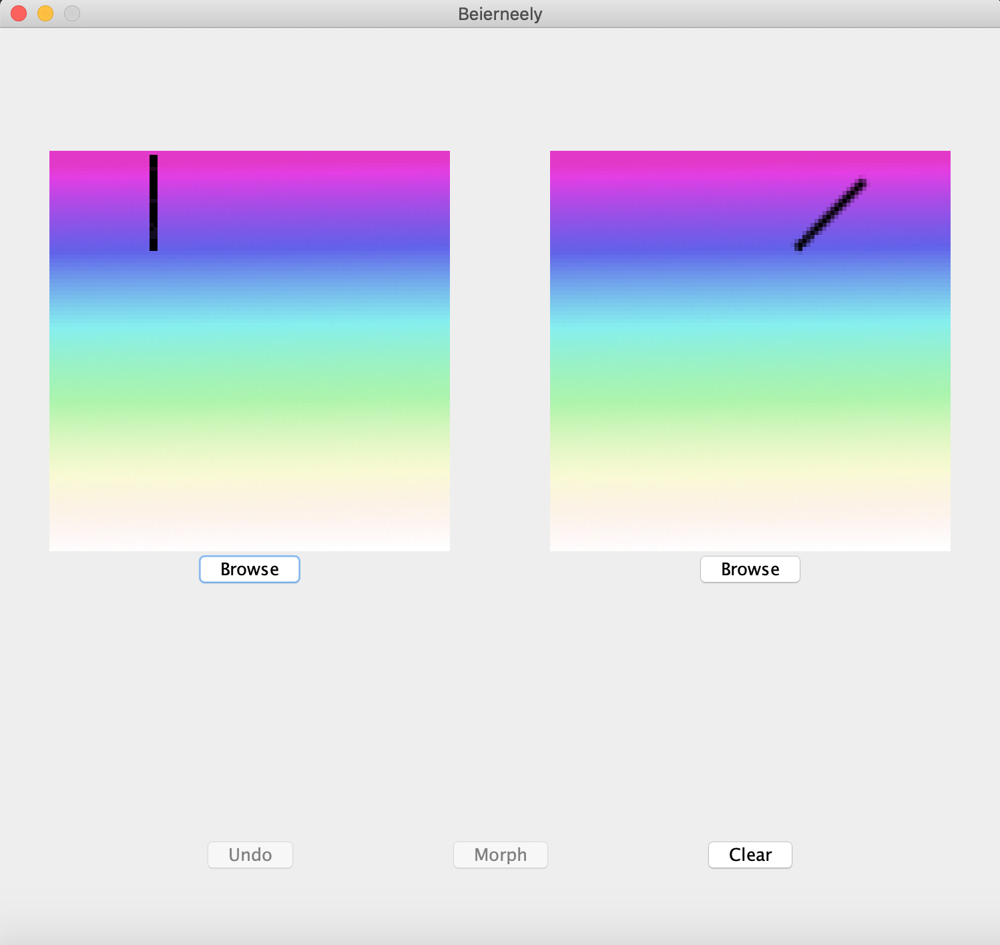
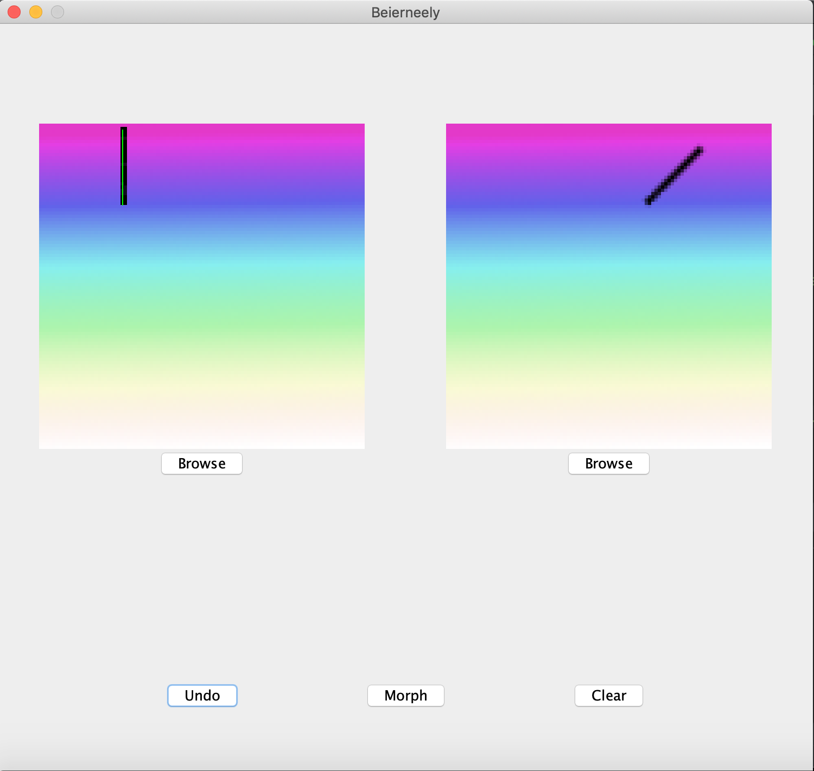
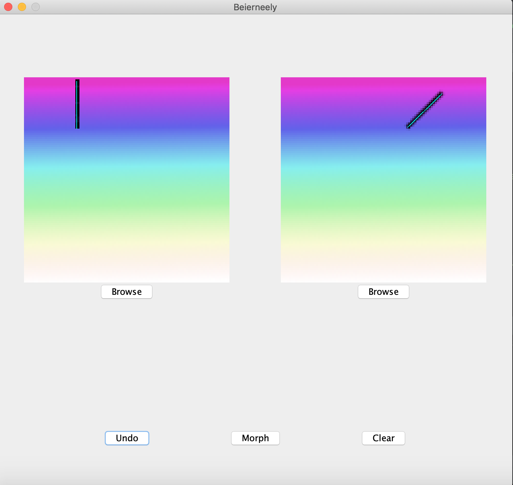

# Beier-Neely Image Morphing  

This is a fun little project that I programmed in my own time. It implements the [Beier-Neely image morphing algorithm](https://www.cs.princeton.edu/courses/archive/fall00/cs426/papers/beier92.pdf) and provides a GUI with it. I also included a few sample videos and photograpies of mine, that can be used to test the GUI.  

***

## :warning: A few Heads-Ups

### Start-Up

* The GUI requires two images to be loaded upon start-up. The code currently uses some images on my computer. You probably need to change the paths in the code (see file [GUI.java](./src/GUI.java), line 26 and line 32) and rebuild the artifact in order for the GUI to work.
* To compile the videos, the GUI requires a [ffmpeg](https://ffmpeg.org/) installation as a dependency. You need to install this manually and then specify the path to the installation in the code (file [GUI.java](./src/GUI.java), line 299).

### Sample Videos

* You might notice a few glitches in some of the provided sample videos. These are intentional; they stem from not properly "drawing the lines" when morphing two images. I thought they looked interesting. To avoid this, always take care when drawing the to-be-morphed lines in the reference and target image!

## :bulb: GUI Walkthrough

1. Via the GUI you can morph the left-hand side image into the right-hand side image. It provides basic functionality, such as undoing, clearing, and browsing for other images. Clicking "morph" triggers the morphing process, but only once a few steps have been undertaken:  
  
2. The user specifies lines in the reference image and corresponding lines in the target image. The algorithm then morphes and blends the first line into the second. The user can draw as many lines to be morphed as desired, as long as there is a matching line in the target image for every line in the reference image. They need to be drawn in order: For every line drawn in the reference/target image, the user has to next draw the corresponding line in the other image! To help keep track, the last drawn line is highlighted in green:  
  
3. Lines that have been matched up are highlighted in cyan. :warning: Please make sure to draw the lines in the "correct orientation": This means that whatever point is the starting point of the first line, needs to also be the starting point of the second line.  
  
4. Once all desired lines have been drawn, click "morph"!  

***
